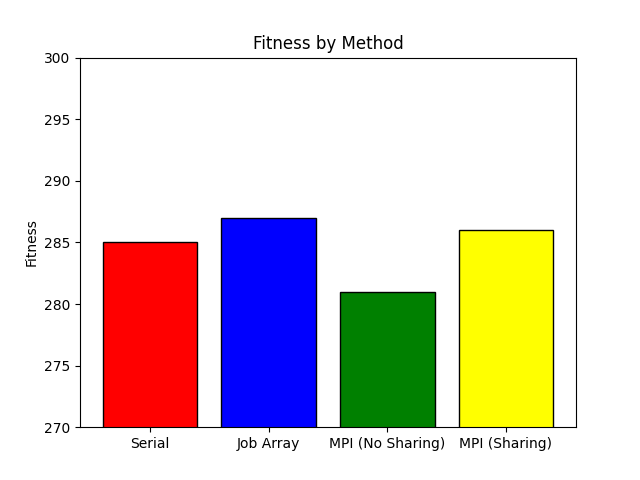

# Reverse Game of Life Parallel Report

## 🧪 Serial Code Performance

The serial version of `reverseGOL.c` was run 10 times using a Bash script to vary the random seed on each run. The program was compiled with `gcc` and executed on the following hardware:

- **Processor**:  Intel Core i7-10700H
- **Cores**: 4 cores
- **Memory**:  16 GB RAM
- **OS**: MacOS Sequoia 15.1

**Best Fitness (Serial)**: 285  
**Average Runtime (Serial)**: 893.797 seconds

This gave me a good baseline understanding of how well the genetic algorithm could perform without parallelization. The fitness values had some variability, but they consistently converged toward the target over time.

---

## 🗂️ Job Array Results

I used a SLURM job array with 50 tasks, each using the same program but a different random seed. This allowed me to explore more of the solution space in parallel.

**Best Fitness (Job Array)**: 287 (#32)

Compared to the serial runs, the job array had the advantage of scaling out the search process. Even though the individual runs were not faster, doing 50 in parallel gave better coverage of possible solutions.

---

## 🔀 MPI (Initial Consolidated) Run

In the first MPI version of the code, each worker evolved its own population independently, and the results were consolidated at the end by rank 0.

**Best Fitness (Initial MPI Run)**: 281

This approach was more efficient than the serial version since all MPI ranks were working simultaneously. However, because workers did not share solutions during execution, convergence was not always optimal.

---

## 🔁 MPI (Sharing / Ring Communication) Run

In the enhanced MPI version, each rank shared its best result with a neighbor (in a ring topology). This allowed ranks to adopt better solutions and improve their own populations during the run.

**Best Fitness (Sharing MPI Run)**: 286

This version consistently produced better results than the isolated MPI run. The ring-sharing helped good solutions propagate across ranks, which often improved the overall population fitness over time.

---

## 📈 Comparison of Final Fitness Values

Below is a bar chart comparing the best final fitness values from each approach:

| Method               | Best Fitness |
|----------------------|--------------|
| Serial               | 285          |
| Job Array            | 287          |
| MPI (No Sharing)     | 281          |
| MPI (With Sharing)   | 286          |

One of the biggest surprises when completing this assignment was that the Job Array had results that outperformed any MPI technique, even the sharing.
I attribute this to random chance with the seeding choices, however, the top fitness levels were very similar for the Job Array and MPI (With Sharing). 
It was also surprising that the MPI (No Sharing) had the worst performance because intuitively I would think it would have similar performance to the Serial and Job Array techniques.

---

## 🧠 Lessons Learned

- **Parallelization is powerful**, but the structure of communication matters. Simply running things in parallel doesn’t guarantee better results unless processes can share useful information.
- **MPI's flexibility** allowed me to move from independent computation to cooperative problem-solving using message passing.
- **Job arrays are great for high-throughput experimentation**, especially for random-seed-dependent programs like genetic algorithms.
- **Debugging MPI** takes time, especially when dealing with potential deadlocks or improper buffer sizes — careful control of send/receive order is essential.

This project helped reinforce my understanding of parallel computing and how to adapt algorithms like genetic search to both shared and distributed systems.

---
